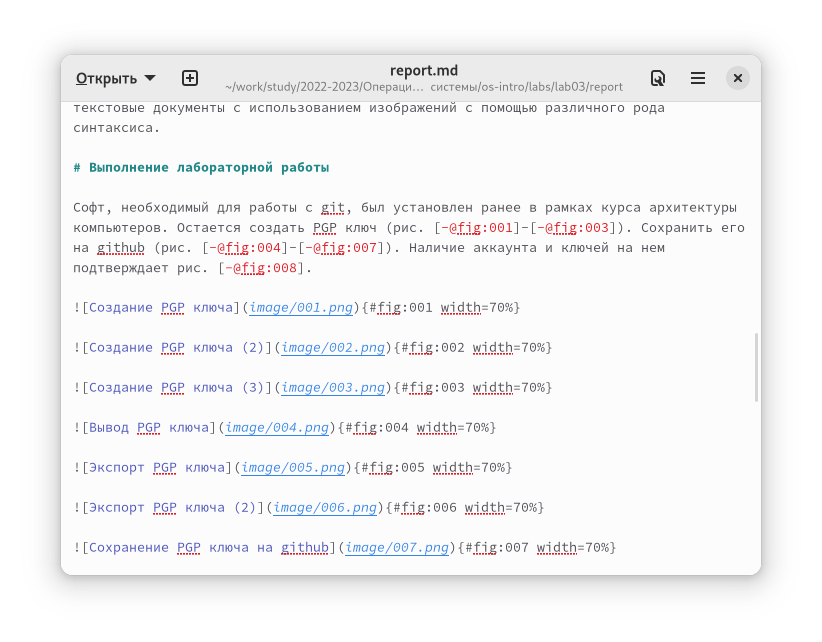
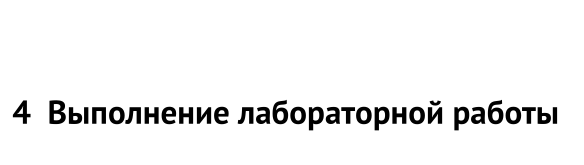
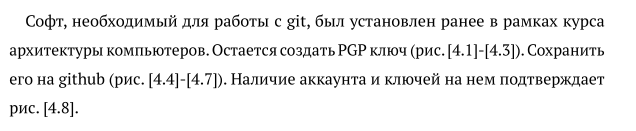
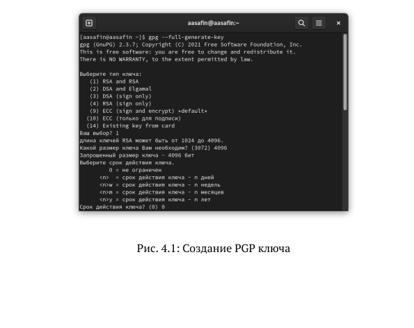

---
## Front matter
lang: ru-RU
title: Лабораторная работа 3
author:
  - Сафин А.С.
institute:
  - Российский университет дружбы народов, Москва, Россия

## i18n babel
babel-lang: russian
babel-otherlangs: english

## Formatting pdf
toc: false
toc-title: Содержание
slide_level: 2
aspectratio: 169
section-titles: true
theme: metropolis
header-includes:
 - \metroset{progressbar=frametitle,sectionpage=progressbar,numbering=fraction}
 - '\makeatletter'
 - '\beamer@ignorenonframefalse'
 - '\makeatother'
---

# Информация

## Докладчик

:::::::::::::: {.columns align=center}
::: {.column width="70%"}

  * Сафин Андрей Алексеевич
  * Студент первого курса направления "Математика и механрик
  * Российский университет дружбы народов

:::
::: {.column width="30%"}

:::
::::::::::::::

# Вводная часть

## Язык разметки markdown

Язык разметки используется для удобного создания текстовых документов.

## Цель лабораторной работы

- Ознакомление с markdown
- Приобретение навыков использования

# Основная часть

## Выполнение лабораторной работы

Составлен отчёт с помощью markdown. Рассмотрим отдельные его составляющие.

{#fig:01 width=70%}

## Выполнение лабораторной работы

{#fig:02 width=70%}

## Выполнение лабораторной работы

{#fig:03 width=70%}

## Выполнение лабораторной работы

{#fig:04 width=70%}

# Вывод
## Вывод

Навык работы с markdown приобретен

