---
## Front matter
title: "Лабораторная работа 2"
author: "Сафин Андрей Алексеевич"

## Generic otions
lang: ru-RU
toc-title: "Содержание"

## Pdf output format
toc: true # Table of contents
toc-depth: 2
lof: true # List of figures
lot: true # List of tables
fontsize: 12pt
linestretch: 1.5
papersize: a4
documentclass: scrreprt
## I18n polyglossia
polyglossia-lang:
  name: russian
  options:
	- spelling=modern
	- babelshorthands=true
polyglossia-otherlangs:
  name: english
## I18n babel
babel-lang: russian
babel-otherlangs: english
## Fonts
mainfont: PT Serif
romanfont: PT Serif
sansfont: PT Sans
monofont: PT Mono
mainfontoptions: Ligatures=TeX
romanfontoptions: Ligatures=TeX
sansfontoptions: Ligatures=TeX,Scale=MatchLowercase
monofontoptions: Scale=MatchLowercase,Scale=0.9
## Biblatex
biblatex: true
biblio-style: "gost-numeric"
biblatexoptions:
  - parentracker=true
  - backend=biber
  - hyperref=auto
  - language=auto
  - autolang=other*
  - citestyle=gost-numeric
## Pandoc-crossref LaTeX customization
figureTitle: "Рис."
tableTitle: "Таблица"
listingTitle: "Листинг"
lofTitle: "Список иллюстраций"
lotTitle: "Список таблиц"
lolTitle: "Листинги"
## Misc options
indent: true
header-includes:
  - \usepackage{indentfirst}
  - \usepackage{float} # keep figures where there are in the text
  - \floatplacement{figure}{H} # keep figures where there are in the text
---

# Цель работы

Приобретение навыков работы с языком разметки markdown.

# Задание

Написать отчет по лабораторной работе 2 в markdown.

# Теоретическое введение

Markdown - язык разметки, позволяющий удобным образом создавать и форматировать текстовые документы с использованием изображений с помощью различного рода синтаксиса.

# Выполнение лабораторной работы

Софт, необходимый для работы с git, был установлен ранее в рамках курса архитектуры компьютеров. Остается создать PGP ключ (рис. [-@fig:001]-[-@fig:003]). Сохранить его на github (рис. [-@fig:004]-[-@fig:007]). Наличие аккаунта и ключей на нем подтверждает рис. [-@fig:008].

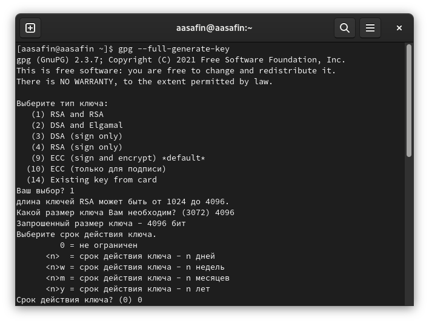{#fig:001 width=70%}

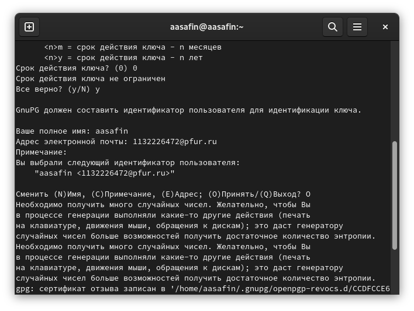{#fig:002 width=70%}

{#fig:003 width=70%}

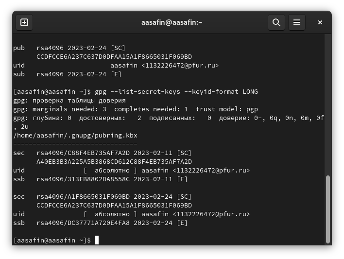{#fig:004 width=70%}

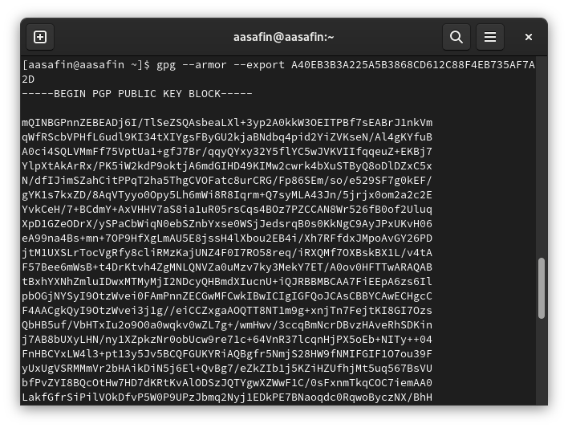{#fig:005 width=70%}

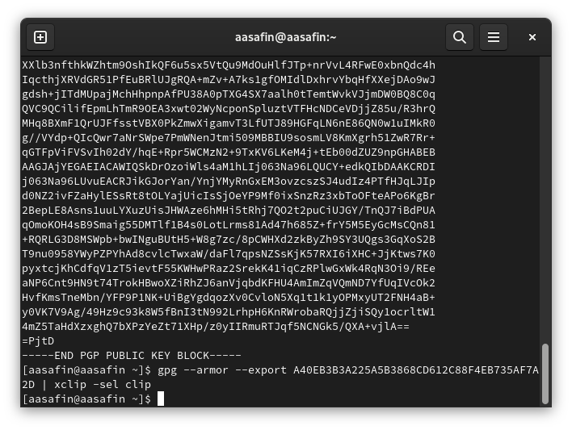{#fig:006 width=70%}

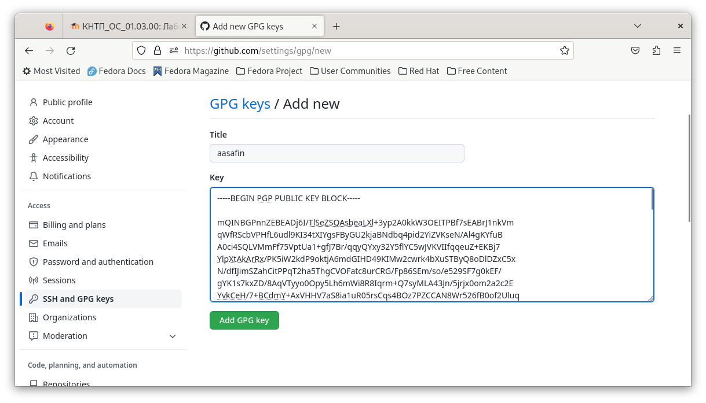{#fig:007 width=70%}

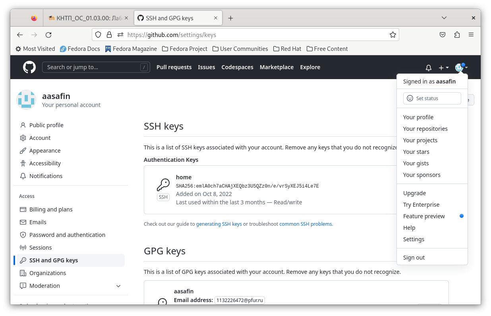{#fig:008 width=70%}

Помимо этого требуется настроить автоматические подписи (рис. [-@fig:009]). Клонировать репозиторий на виртуальную машину (рис. [-@fig:010]-[-@fig:011]). И настроить структуру файлов (рис. [-@fig:012]-[-@fig:013]).

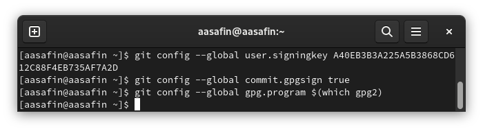{#fig:009 width=70%}

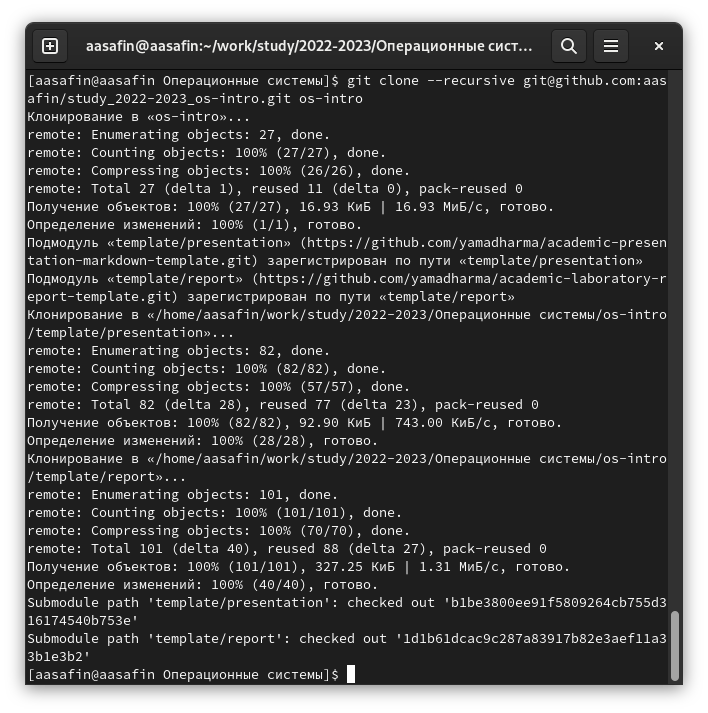{#fig:010 width=70%}

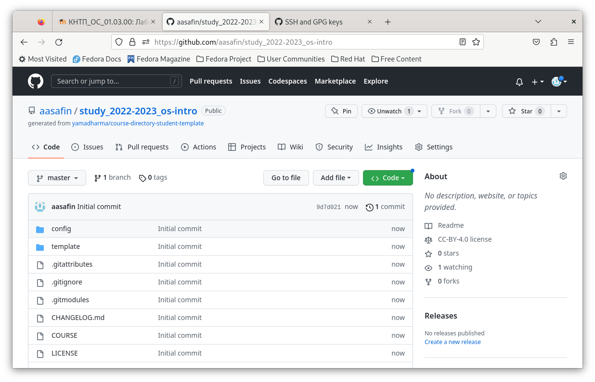{#fig:011 width=70%}

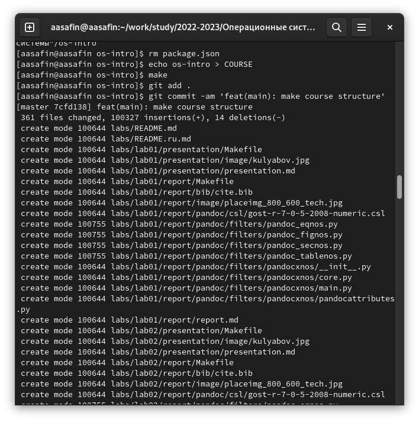{#fig:012 width=70%}

{#fig:013 width=70%}

# Ответы на контрольные вопросы

1. VCS - система контроля версий. Используется для удобной работы множества людей над одним проектом. Позволяет разделять изменения в зависимости от автора и момента изменения, применять их по отдельности, и возвращаться к более старым версиям проекта.
2. Хранилище - место хранения версий. Commit - фиксация изменений с остороны определенного лица. История - список внесенных изменений, структурированный по времени. Рабочая копия - локальная копия документа, располагающаяся в память устройства пользователя.
3. Централизованная модель - модель, в которой единый сервер обеспечивает хранилище и большую часть функций контроля версий. Пример: CVS. В децентрализованных системах же единый сервер необязателен. Пример: git.
4. Стягивание изменений из репозитория для работы с нужной версией, изменение версии пользователем, коммит изменений с возможными комментариями и задвигание изменений обратно на репозиторий.
5. Описание действий в пункте 4 соответствует порядку работы с общим хранилищем.
6. Основные задачи, решаемые инструментами git - задачи систем контроля версий.
7. pull - стягивание изменений, получение рабочий копии. add - добавление изменений в коммит. commit - фиксация изменений. push - отправление изменений на репозиторий.
8. Например, если имеется проект, включающий создание обширной программы, части кода которой распределены между сотрудниками, может быть использован git для удобства контроля версий на удаленном репозитории. Также может быть достаточно системы контроля, использующей локальный репозиторий, в случае, если работа происходит в пределах одной локации, и не требует выхода в интернет.
9. Ветвь - это версия проекта, существующая независимо от основной версии. Используются ветви для привнесения изменений разными людьми или привнесения изменений разного характера с дальнейшей возможностью различать их откатывать их, наоборот, сливать воедино, или выбирать необходимые и добавлять только их.
10. Игнорировать файлы можно с помощью команды add, использованной к ограниченному количеству файлов, и команды remove. Это делается в случае, если пользователь не хочет сохранения некоторых изменений на репозитории.

# Выводы

Навык работы с языком разметки markdown освоен.

