---
## Front matter
title: "Лабораторная работа 4"
author: "Сафин Андрей Алексеевич"

## Generic otions
lang: ru-RU
toc-title: "Содержание"

## Bibliography
bibliography: bib/cite.bib
csl: pandoc/csl/gost-r-7-0-5-2008-numeric.csl

## Pdf output format
toc: true # Table of contents
toc-depth: 2
lof: true # List of figures
lot: true # List of tables
fontsize: 12pt
linestretch: 1.5
papersize: a4
documentclass: scrreprt
## I18n polyglossia
polyglossia-lang:
  name: russian
  options:
	- spelling=modern
	- babelshorthands=true
polyglossia-otherlangs:
  name: english
## I18n babel
babel-lang: russian
babel-otherlangs: english
## Fonts
mainfont: PT Serif
romanfont: PT Serif
sansfont: PT Sans
monofont: PT Mono
mainfontoptions: Ligatures=TeX
romanfontoptions: Ligatures=TeX
sansfontoptions: Ligatures=TeX,Scale=MatchLowercase
monofontoptions: Scale=MatchLowercase,Scale=0.9
## Biblatex
biblatex: true
biblio-style: "gost-numeric"
biblatexoptions:
  - parentracker=true
  - backend=biber
  - hyperref=auto
  - language=auto
  - autolang=other*
  - citestyle=gost-numeric
## Pandoc-crossref LaTeX customization
figureTitle: "Рис."
tableTitle: "Таблица"
listingTitle: "Листинг"
lofTitle: "Список иллюстраций"
lotTitle: "Список таблиц"
lolTitle: "Листинги"
## Misc options
indent: true
header-includes:
  - \usepackage{indentfirst}
  - \usepackage{float} # keep figures where there are in the text
  - \floatplacement{figure}{H} # keep figures where there are in the text
---

# Цель работы

Приобретение практических навыков взаимодействия пользователя с системой по-
средством командной строки.

# Задание

Воспользоваться основными командами терминала для выполнения заданий, описанных в лабораторной работе.

# Теоретическое введение

Командная строка используется для удобного взаимодействия пользователя с операционной системой. Основные команды позволяют работать с данными, находящимися в системе, их структурой (cd, mkdir, ls, touch, rm) и содержимым. Так же есть команда man, дающая информацию о команде, введенной в качестве аргумента. 

# Выполнение лабораторной работы

1. С помощью команд cd и ls было определено имя домашнего каталога: /home/aasafin (рис. @fig:001). 

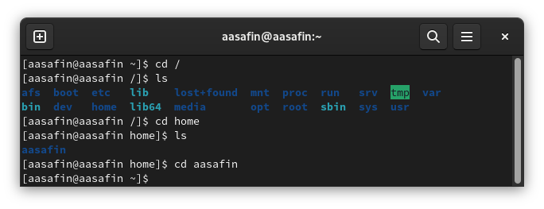{#fig:001 width=70%}

2. С помощью тех же команд исследовано содержимое /tmp (опция а позволила рассмотреть скрытые файлы) (рис. @fig:002) и /var/spool (подкаталог cron отсутствует) (рис. @fig:003), а также выведен владелец файлов домашнего каталога  (рис. @fig:004).

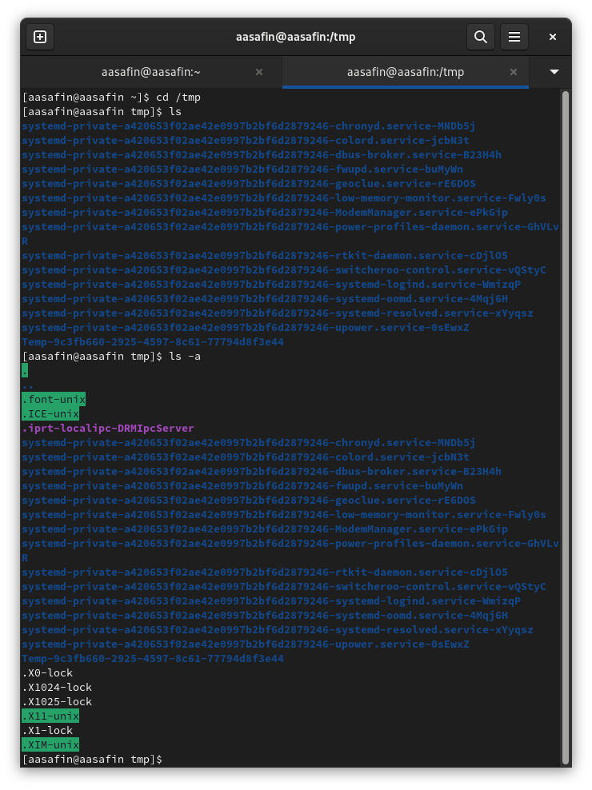{#fig:002 width=70%}

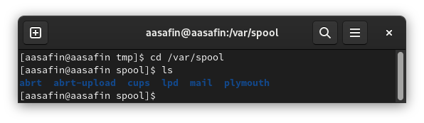{#fig:003 width=70%}

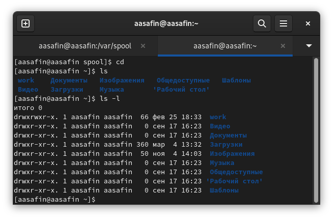{#fig:004 width=70%}

3. Выполнены действия по созданию и удалению директорий, описанные в третьем пункте (рис. @fig:005)

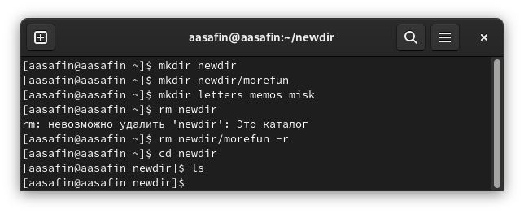{#fig:005 width=70%}

4. С помощью команды man выяснена опция ls для просмотра содержимое не только указанного каталога, но и подкаталогов, входящих в него: -R (рис. @fig:006).

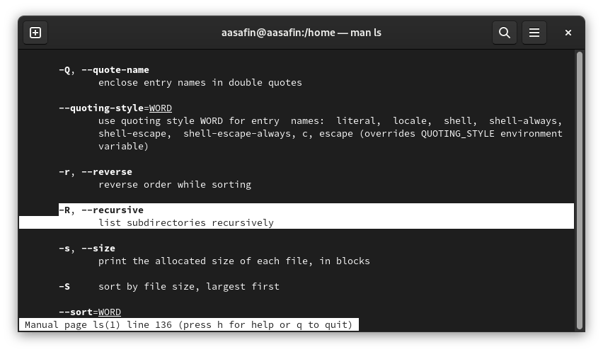{#fig:006 width=70%}

5. С помощью команды man выяснен набор опций команды ls, позволяющий отсорти-
ровать по времени последнего изменения выводимый список содержимого каталога
с развёрнутым описанием файлов: -lct (рис. @fig:007).

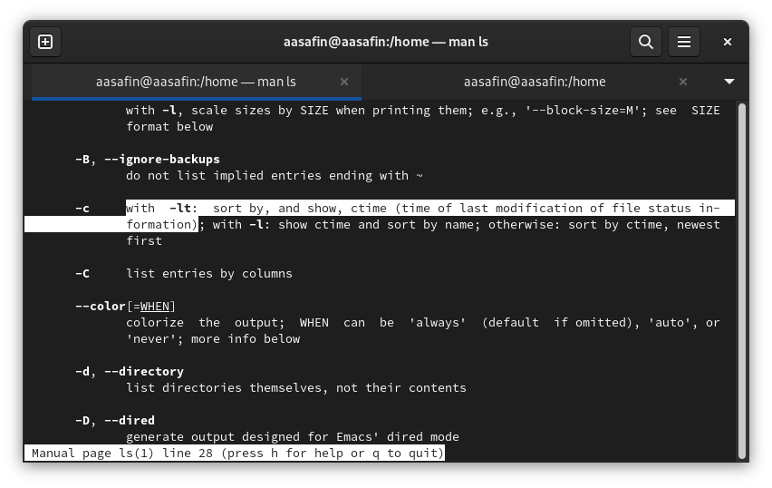{#fig:007 width=70%}

6. Рассмотрены опции команд:

cd (например, .. для повышения уровня) (рис. @fig:008)

pwd (например, -P для избегания символических ссылок) (рис. @fig:009)

mkdir (например, -v для выведения сообщения о каждой созданной директории) (рис. @fig:010)

rmdir (например, -p для удаления не только директории, но и родительских директорий, указанных в маршруте) (рис. @fig:011)

rm (например, -r для рекурсивного удаления директорий и их содержимого) (рис. @fig:012)

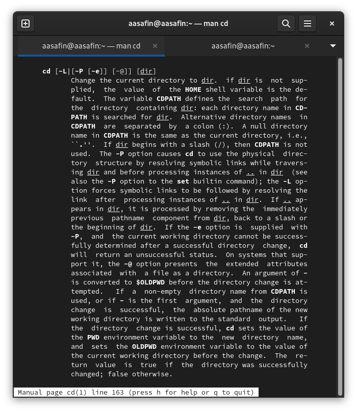{#fig:008 width=70%}

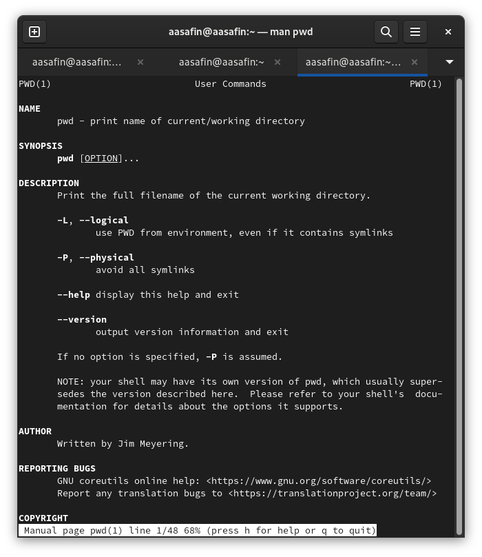{#fig:009 width=70%}

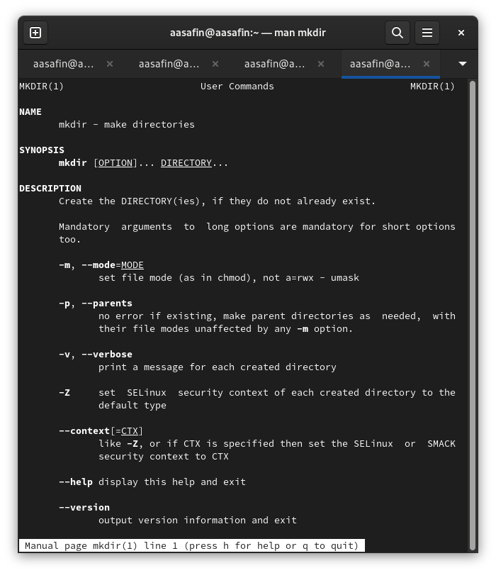{#fig:010 width=70%}

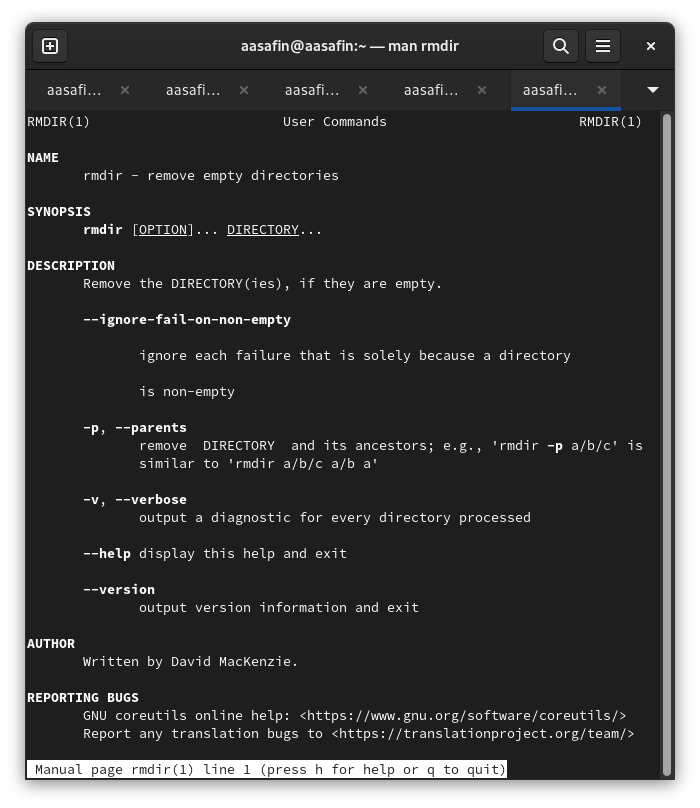{#fig:011 width=70%}

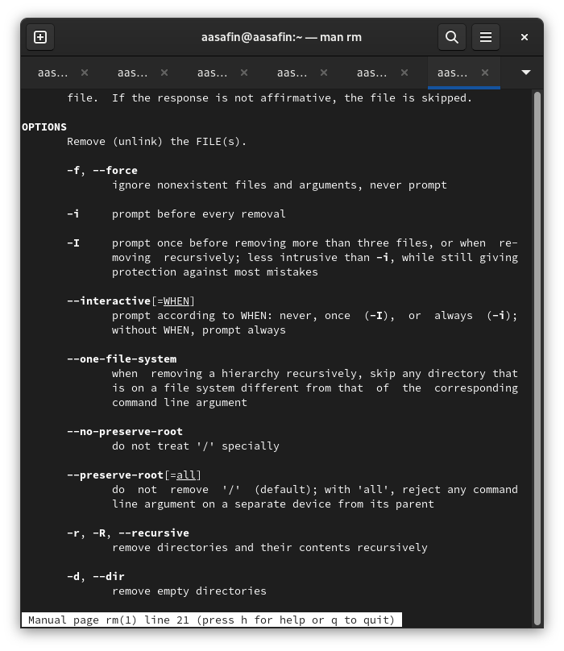{#fig:012 width=70%}

7. Использована команда history, а затем запись вида !"номер":s/"заменяемое"/"то, на что заменяется" для использования модифицированных предыдущих команд (рис. @fig:012).

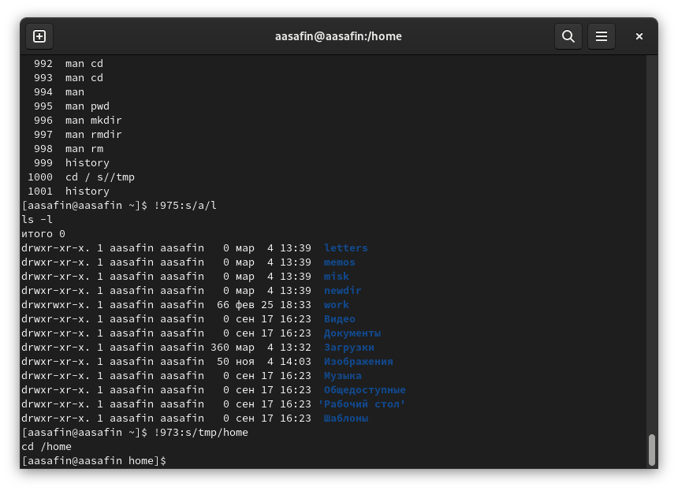{#fig:013 width=70%}

# Выводы

Задания выполнены корректно, практические навыки работы с файловой системой с помощью командной строки приобретены.

# Ответы на контрольные вопросы 

1. Командная строка - это инструмент управления операционной системой через текстовые команды.
2. pwd (например, при нахождении в домашнем каталоге команда выведет "/home/'username')
3. ls -F (например, при нахождении в домашнем каталоге команда выведет его содержимое и тип файлов)
4. ls -a (например, при нахождении в домашнем каталоге единственного скрытого файла .file1 команда выведет его и прочее содержимое домашнего каталога)
5. rm (-r), rmdir (rmdir сработает только на пустом каталоге, например, rmdir ~/dir1/emptydir, rm же либо удалит указанный файл, либо удалит всё содержимое указанного каталога и сам каталог при использовании ключа r)
6. history
7. history --> !"номер команды":s/"заменяемое"/"то, на что заменяется"
8. cd; ls - переводит в домашний каталог и показывает его содержимое. cd ..; mkdir newdir - переводит в родительский каталог и создает директорию "newdir"
9. Символ экранирования - это символ, заставляющий систему интерпретировать специальные символы, как обычные, например, "\"
10. Выводится список каталогов с подробной информацией о них.
11. Относительный путь - это путь от каталога, в котором находится пользователь. Если пользователь находится в каталоге /home/"username"/dir1, то команды cd dir2 и cd ~/dir1/dir2 будут выполнять одно действие.
12. С помощью команды man.
13. Tab
