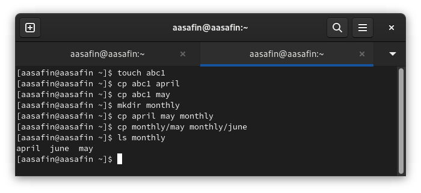
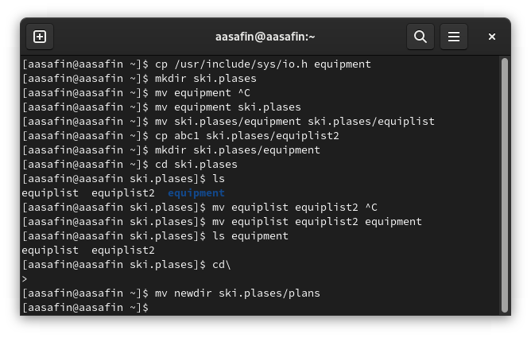
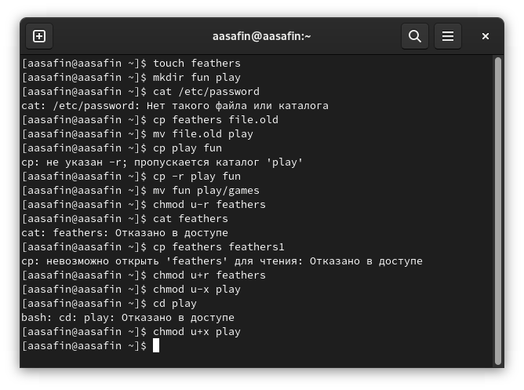
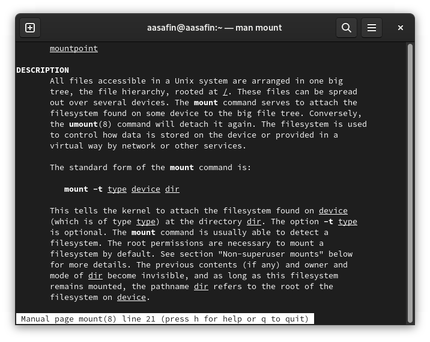

---
## Front matter
lang: ru-RU
title: Лабораторная работа 5
author:
  - Сафин А. А.
institute:
  - Российский университет дружбы народов, Москва, Россия

## i18n babel
babel-lang: russian
babel-otherlangs: english

## Formatting pdf
toc: false
toc-title: Содержание
slide_level: 2
aspectratio: 169
section-titles: true
theme: metropolis
header-includes:
 - \metroset{progressbar=frametitle,sectionpage=progressbar,numbering=fraction}
 - '\makeatletter'
 - '\beamer@ignorenonframefalse'
 - '\makeatother'
---

# Информация

## Докладчик

:::::::::::::: {.columns align=center}
::: {.column width="70%"}

  * Сафин Андрей Алексеевич
  * студент первого курса направления "Математика и механика"
  * Российский университет дружбы народов
  * [1132226472@pfur.ru](mailto:1132226472@pfur.ru)

:::
::: {.column width="30%"}

:::
::::::::::::::

# Вводная часть

## Цели и задание:
- Изучение файловой системы Linux и методов работы с ней
- Выполнение действий с файлами и директориями, а так же правами их использования

# Выполнение лабораторной работы

##  Выполнение лабораторной работы

{#fig:001 width=50%}

##  Выполнение лабораторной работы

{#fig:002 width=35%}

##  Выполнение лабораторной работы

{#fig:003 width=35%}

##  Выполнение лабораторной работы

{#fig:004 width=35%}

# Заключитльеная часть

## Выводы

- Действия, описанные в лабораторной работе, выполнены. Знания о файловой системе и навыки её использования приобретены.

:::

