---
## Front matter
title: "Лабораторная работа 5"
author: "Сафин Андрей Алексеевич"

## Generic otions
lang: ru-RU
toc-title: "Содержание"

## Bibliography
bibliography: bib/cite.bib
csl: pandoc/csl/gost-r-7-0-5-2008-numeric.csl

## Pdf output format
toc: true # Table of contents
toc-depth: 2
lof: true # List of figures
lot: true # List of tables
fontsize: 12pt
linestretch: 1.5
papersize: a4
documentclass: scrreprt
## I18n polyglossia
polyglossia-lang:
  name: russian
  options:
	- spelling=modern
	- babelshorthands=true
polyglossia-otherlangs:
  name: english
## I18n babel
babel-lang: russian
babel-otherlangs: english
## Fonts
mainfont: PT Serif
romanfont: PT Serif
sansfont: PT Sans
monofont: PT Mono
mainfontoptions: Ligatures=TeX
romanfontoptions: Ligatures=TeX
sansfontoptions: Ligatures=TeX,Scale=MatchLowercase
monofontoptions: Scale=MatchLowercase,Scale=0.9
## Biblatex
biblatex: true
biblio-style: "gost-numeric"
biblatexoptions:
  - parentracker=true
  - backend=biber
  - hyperref=auto
  - language=auto
  - autolang=other*
  - citestyle=gost-numeric
## Pandoc-crossref LaTeX customization
figureTitle: "Рис."
tableTitle: "Таблица"
listingTitle: "Листинг"
lofTitle: "Список иллюстраций"
lotTitle: "Список таблиц"
lolTitle: "Листинги"
## Misc options
indent: true
header-includes:
  - \usepackage{indentfirst}
  - \usepackage{float} # keep figures where there are in the text
  - \floatplacement{figure}{H} # keep figures where there are in the text
---

# Цель работы

Ознакомление с файловой системой Linux, её структурой, именами и содержанием
каталогов. Приобретение практических навыков по применению команд для работы
с файлами и каталогами, по управлению процессами (и работами), по проверке исполь-
зования диска и обслуживанию файловой системы.

# Задание

Выполнить манипуляции с файлами и директориями, описанные в лабораторной работе.

# Теоретическое введение

Файловая система - это способ физического хранения информации на жестком диске, которую группируют как файлы, а так же формат её хранения. 

В рамках системы Linux для работы с файловой системой используются следующие команды:

touch - создание файла

mkdir - создание директории

cat - чтение файла

cd - смена директории

mv - перемещение файла/каталога с возможным переименованием

cp - копирование файла/каталога с возможным переименованием

chmod - изменение прав доступа к файлу/каталогу

# Выполнение лабораторной работы

1. Выполнены примеры использования команд для работы с файловой системой, описанные в лабораторной работе (рис. @fig:001-@fig:005).

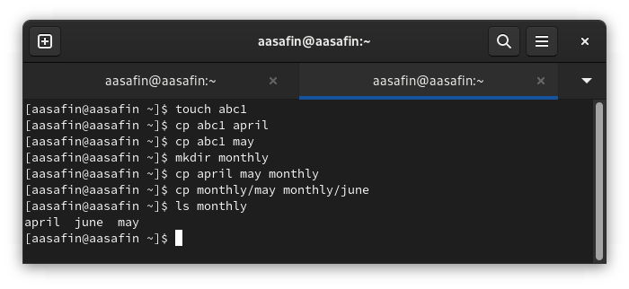{#fig:001 width=70%}

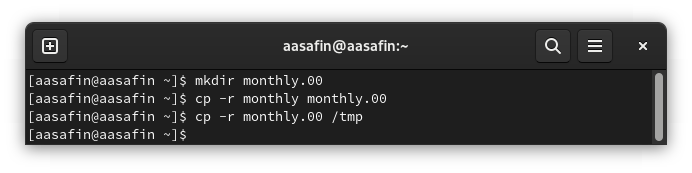{#fig:002 width=70%}

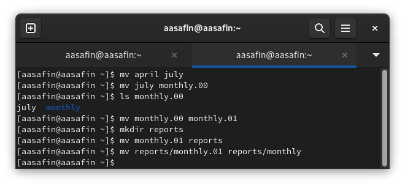{#fig:003 width=70%}

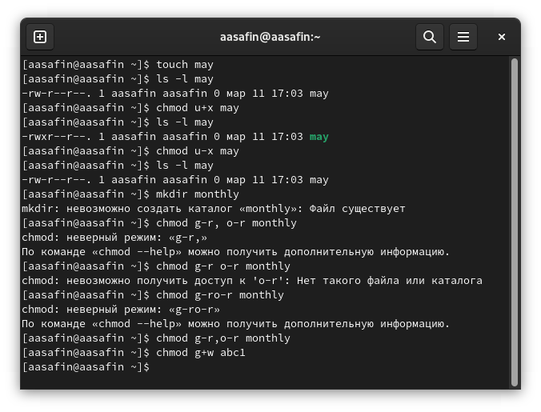{#fig:004 width=70%}

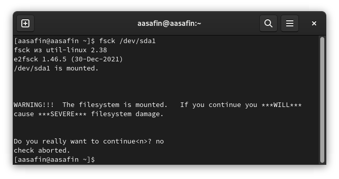{#fig:005 width=70%}

2. Проведены манипуляции (такие, как создание, перемещение, копирование и переименовывание) с файлами и каталогами, описанные во втором пункте задания (рис. @fig:006).

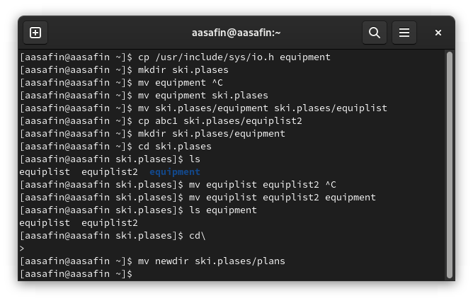{#fig:006 width=70%}

3. Определены опции команды chmod, присваивающие перечисленным в задании лабораторной работы файлам соответствующие права: 744, 711, 544, 664.

4. Проведены манипуляции (такие, как создание, перемещение, копирование и переименовывание и присваивание прав) с файлами и каталогами, описанные во втором пункте задания (рис. @fig:007). Как можно видеть, при отсутствии прав чтения файла невозможно использовать команды cat и cp, а при отсутствии права на выполнение директории нельзя её посещать.

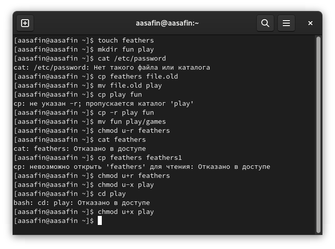{#fig:007 width=70%}

5. Использована команда man к командам mount, fsck, mkfs, kill:

Mount прикрепляет определенную файловую систему к директории (рис. @fig:008).

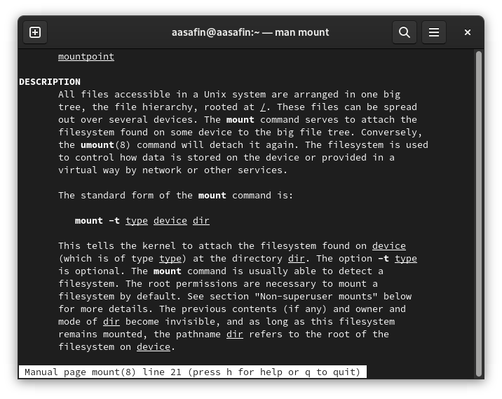{#fig:008 width=70%}

fsck проверяет и опционально восстанавливает файловые системы Linux (рис. @fig:009).

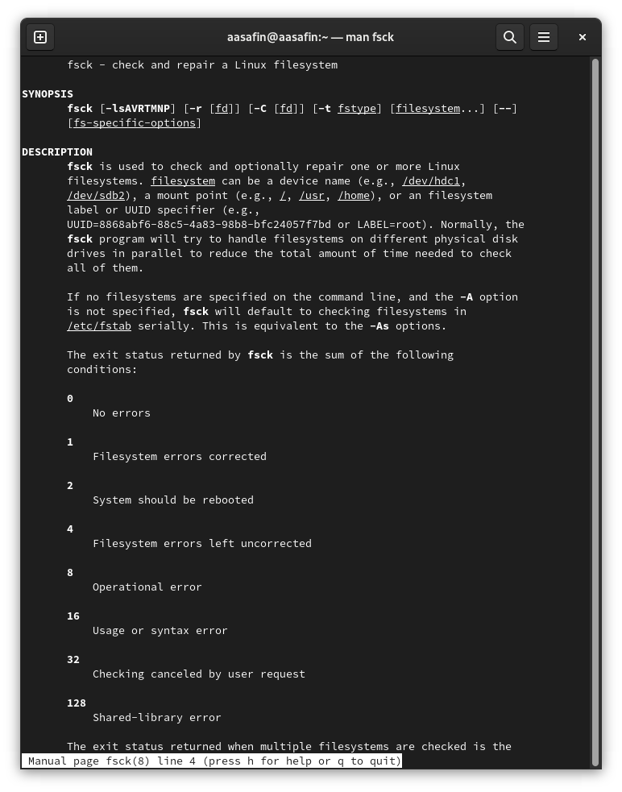{#fig:009 width=70%}

mkfs создает файловую систему на носителе или его части (от make filesystem) (рис. @fig:010).

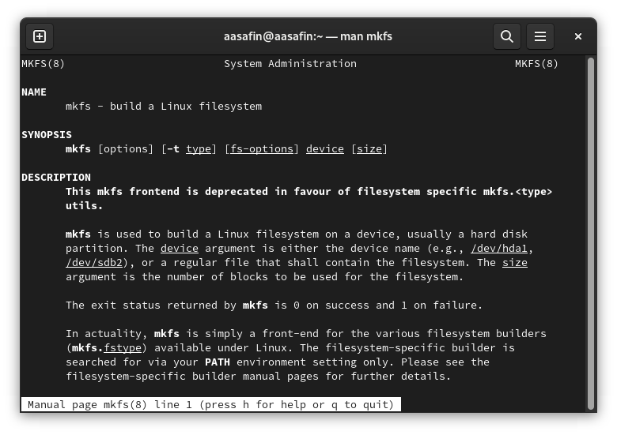{#fig:010 width=70%}

kill прекращает процессы, указанные в аргументе (рис. @fig:011).

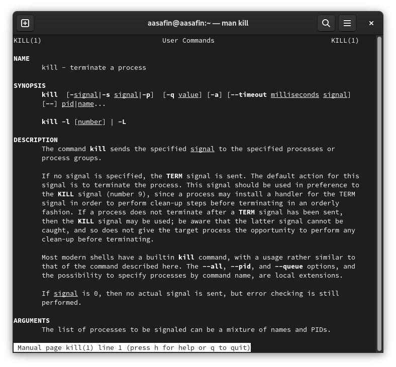{#fig:011 width=70%}

# Ответы на контрольные вопросы

1. tmpfs - временное файловое хранилище, предназначенное для монтирования файловой системы.
devtmpfs - позволяет ядру создать экземпляр tmpfs с именем devtmpfs до регистрации устройств с драйверами
ext4 - версия журналируемой файловой системы extended file system 2006-го года, широко использующаяся в системах UNIX.
btrfs - файловая система для Linux основанная на B-деревьях и использующая принцип copy-on-write.
2. Файловая система представляет собой пространство раздела диска, разбитое на целое число КБ. Главным каталогом является корневой /, все данный примонтированны к нему и хранятся в подкаталогам. Доступ к данным получается при указании адреса соответствующего каталога.

BIN - исполняемые файлы

SBIN - системные исполняемые файлы

ETC - конфигурационные файлы

DEV - файлы устройств

PROC - информация о процессах

VAR - переменные файлы

TMP - временные файлы

USR - программы пользователя

HOME - домашняя папка, содержащая каталоги всех пользователей

BOOT - файлы загрузчика

LIB - системные библиотеки

OPT - дополнительные программы

MNT - каталог, в который монтируются внешние и дополнительные файловые системы

MEDIA - съемные носители

SRV - файлы серверов и сервисов

RUN - процессы

3. Команда mount

4. Целостность нарушается при прерывании процессов без возможности их подчистки (clean-up). Восстанавливается с помощью fsck.

5. С помощью mkfs.

6. cat - выводит содержимое
less - выводит содержимое по частям, позволяя его листать
head - выводит первые 10 строк
tail - выводит последние 10 строк

7. cp позволяет копировать файлы в иные директории под старым либо новым именем. Так же может рекурсивно копировать директории (-r).

8. cp позволяет перемещать файлы в иные директории под старым либо новым именем. Так же может рекурсивно перемещать директории (-r). С её помощью можно просто переименовать файл.

9. Права доступа - это список действий с файлом или директорий, которые могут производить различные пользователи. Они изменяются с помощью команды chmod.

# Выводы

Описанные в лабораторной работе действия произведены, навык работы с файловой системой приобретен. 

