---
## Front matter
title: "Лабораторная работа 6"
author: "Сафин Андрей Алексеевич"

## Generic otions
lang: ru-RU
toc-title: "Содержание"

## Bibliography
bibliography: bib/cite.bib
csl: pandoc/csl/gost-r-7-0-5-2008-numeric.csl

## Pdf output format
toc: true # Table of contents
toc-depth: 2
lof: true # List of figures
lot: true # List of tables
fontsize: 12pt
linestretch: 1.5
papersize: a4
documentclass: scrreprt
## I18n polyglossia
polyglossia-lang:
  name: russian
  options:
	- spelling=modern
	- babelshorthands=true
polyglossia-otherlangs:
  name: english
## I18n babel
babel-lang: russian
babel-otherlangs: english
## Fonts
mainfont: PT Serif
romanfont: PT Serif
sansfont: PT Sans
monofont: PT Mono
mainfontoptions: Ligatures=TeX
romanfontoptions: Ligatures=TeX
sansfontoptions: Ligatures=TeX,Scale=MatchLowercase
monofontoptions: Scale=MatchLowercase,Scale=0.9
## Biblatex
biblatex: true
biblio-style: "gost-numeric"
biblatexoptions:
  - parentracker=true
  - backend=biber
  - hyperref=auto
  - language=auto
  - autolang=other*
  - citestyle=gost-numeric
## Pandoc-crossref LaTeX customization
figureTitle: "Рис."
tableTitle: "Таблица"
listingTitle: "Листинг"
lofTitle: "Список иллюстраций"
lotTitle: "Список таблиц"
lolTitle: "Листинги"
## Misc options
indent: true
header-includes:
  - \usepackage{indentfirst}
  - \usepackage{float} # keep figures where there are in the text
  - \floatplacement{figure}{H} # keep figures where there are in the text
---

# Цель работы

Ознакомление с инструментами поиска файлов и фильтрации текстовых данных.
Приобретение практических навыков: по управлению процессами (и заданиями), по
проверке использования диска и обслуживанию файловых систем.

# Задание

Воспользоваться командами поиска информации в системе, управления процессами и символами перенаправления ввода-вывода и конвейера для выполнения описанных в лабораторной работе пунктов.

# Теоретическое введение

Перенаправлять ввод и вывод можно с помощью стрелок >, >>, <, <<.

Выполнять команды последовательно, использую данные предыдущих, можно с помощью символа |.

Для работы с данными используются команды:
- find - поиск файлов
- grep - поиск строки

Для анализа использования диска используются команды:
- df - загруженность файловых систем
- du - загруженность директорий

Для работы с процессами используются команды:
- ps - получение информации
- kill - прекращение процесса

# Выполнение лабораторной работы
1. Осуществлен вход в систему.
2. Записаны в файл file.txt названия файлов, содержащихся в каталоге /etc. Допи-
саны в этот же файл названия файлов, содержащихся в домашнем каталоге (рис. @fig:001-@fig:002).

3. Выведены имена всех файлов из file.txt, имеющих расширение .conf, а затем
записаны в новый текстовой файл conf.txt (рис. @fig:001-@fig:002).

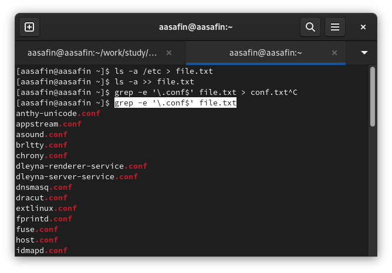{#fig:001 width=70%}

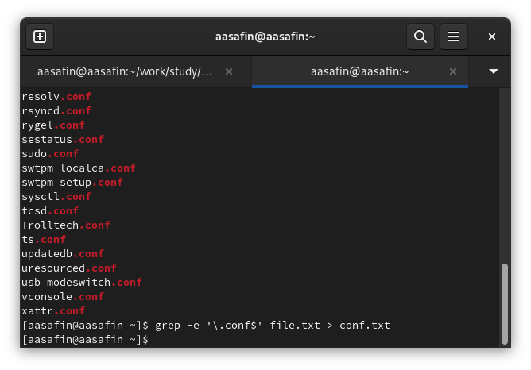{#fig:002 width=70%}

4. Найдены файлы в ~, названия которых начинаются с "с" (рис. @fig:003). Также это можно было сделать с использования ключа -maxdepth, исключающего файлы из подкаталогов. 

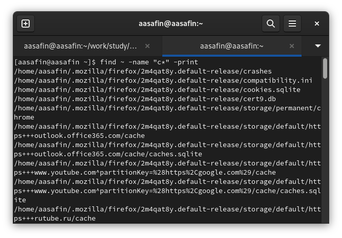{#fig:003 width=70%}

5. Постранично выведены на экран имена файлов из каталога /etc, начинающиеся
с символа h (рис. @fig:004-@fig:005)

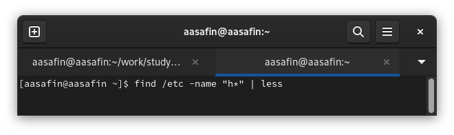{#fig:004 width=70%}

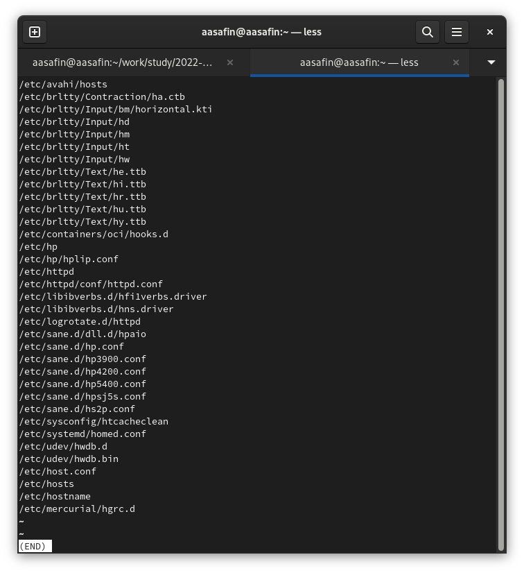{#fig:005 width=70%}

6. В фоновом режиме записаны в файл logfile имена файлов, начинающиеся с log (рис. @fig:006).

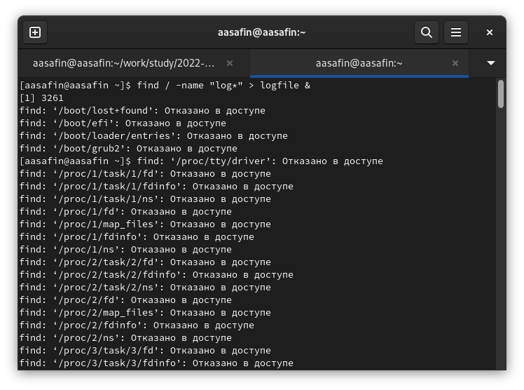{#fig:006 width=70%}

7. Удален logfile (рис. @fig:007).

8. Фоново запущен gedit (рис. @fig:007).

9. Определен идентификатор gedit (рис. @fig:007). Также это можно было сделать, используя команду pgrep gedit.

10. Изучена справка по kill (рис. @fig:008). Процесс gedit завершён (рис. @fig:007).

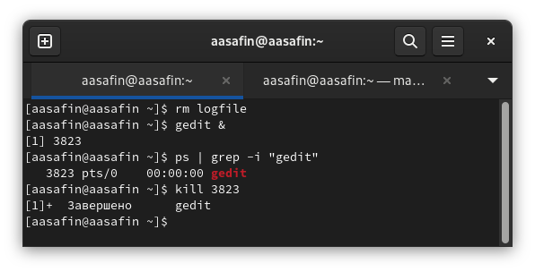{#fig:007 width=70%}

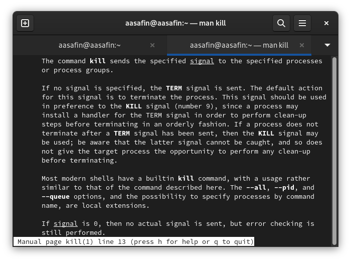{#fig:008 width=70%}

11. Изучены справки по df и du (рис. @fig:009-@fig:010). Данные команды использованы с ключём -h для того, чтоб информация об объеме данных выводилась в байтах, КБ, МБ и т.д. (рис. @fig:011).

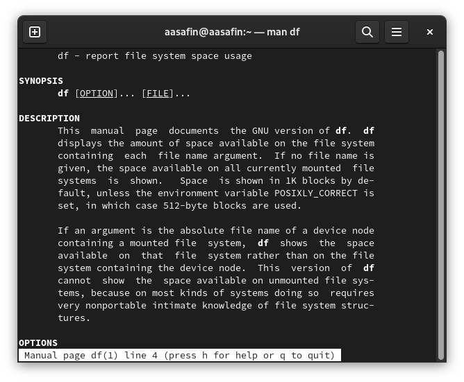{#fig:009 width=70%}

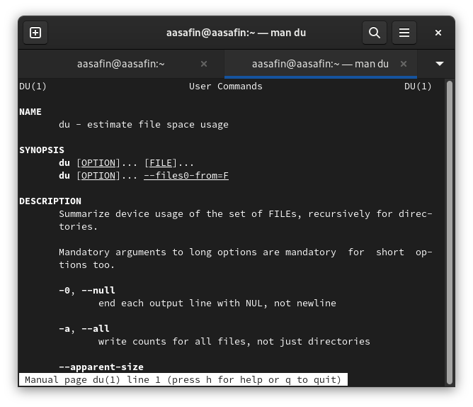{#fig:010 width=70%}

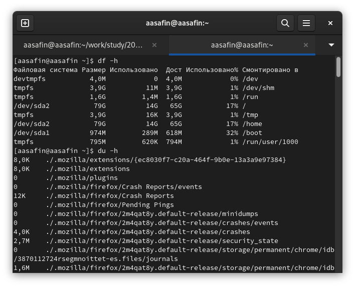{#fig:011 width=70%}

12. Получена справка по find (рис. @fig:013). Выведены имена всех директорий домашнего каталога с помощью ключа -type d (рис. @fig:012).

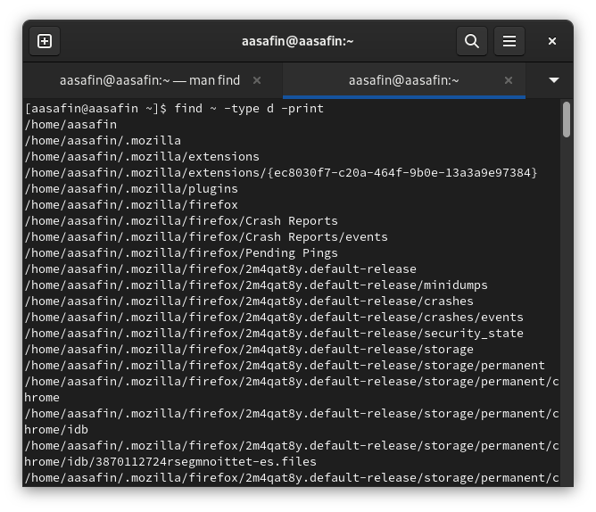{#fig:012 width=70%}

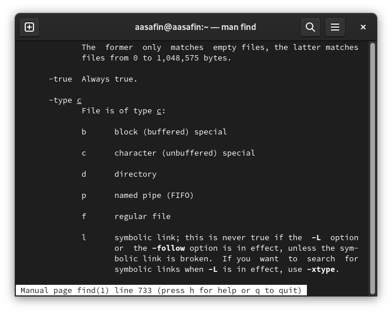{#fig:013 width=70%}

# Выводы

Поставленные задачи выполнены, навыки работы с командами перенаправления, конвейерами, командами поиска и процессами получены.

# Ответы на контрольные вопросы
1. stdin, stdout, stderr.
2. > записывает вывод в пустой файл, >> дописывает вывод в существующий.
3. Цепочка из нескольких команд, в которой следующая работает с данными, полученными предыдущей.
4. Программа - это последовательность команд процессору, а процесс - выполнение программы в реальном времени.
5. pid - идентификатор процесса, gid - идентификатор группы UNIX, в которой идет процесс.
6. Задача - это фоновый процесс. Начинать их можно с помощью амперсанда &, а завершать с помощью команд прерывания таких, как kill.
7. top - программа, показывающая осортированный по нагрузке на процессор список процессов в системе. htop делает то же самое, но выводит больше полезных данных.
8. Команда поиска - find. В зависимости от аргументов и ключей ищет файлы или директории по названиям или другим характеристикам. Например, find ~/works -name "01\*" -print найдет и выведет файлы из ~/works с именем, начинающимся на 01.
9. Можно с помощью grep.
10. Определить объём свободной памяти можно используя df.
11. С помощью команды du ~.
12. С момщью команды kill или, если она не работает, KILL.
