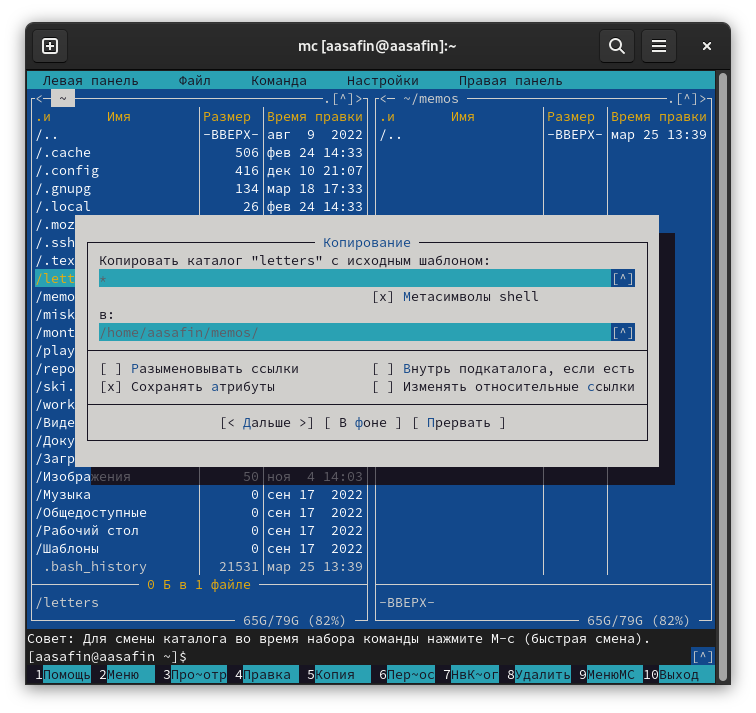
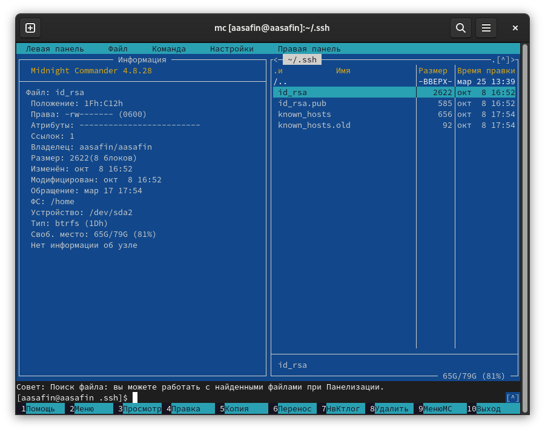
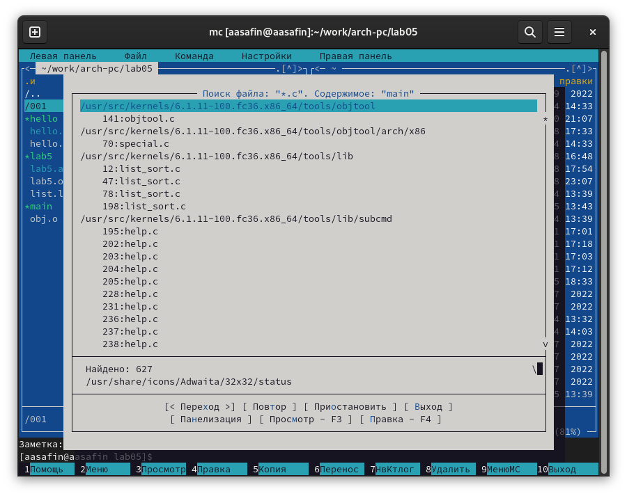
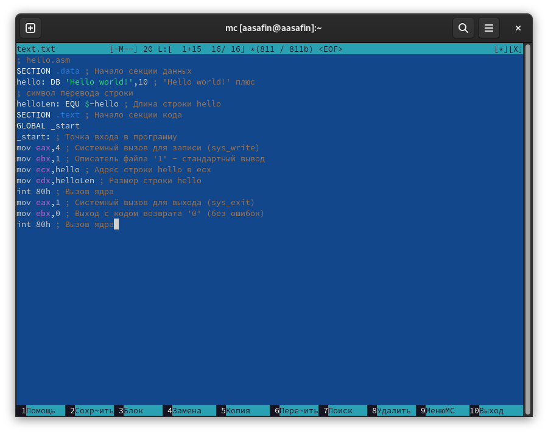
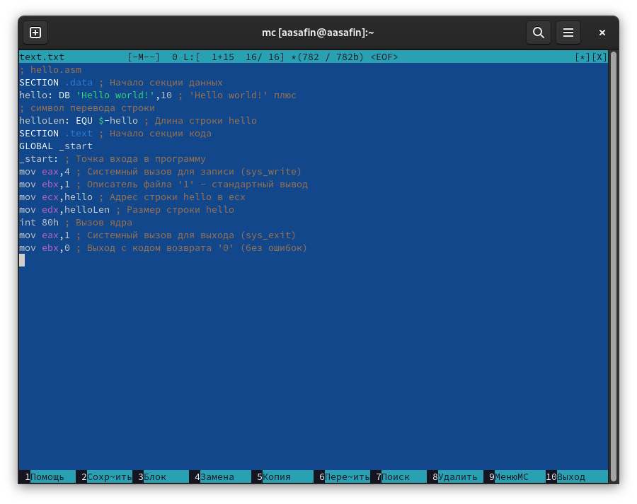

---
## Front matter
lang: ru-RU
title: Лабораторная работа 7
author:
  - Сафин А. А.
institute:
  - Российский университет дружбы народов, Москва, Россия

## i18n babel
babel-lang: russian
babel-otherlangs: english

## Formatting pdf
toc: false
toc-title: Содержание
slide_level: 2
aspectratio: 169
section-titles: true
theme: metropolis
header-includes:
 - \metroset{progressbar=frametitle,sectionpage=progressbar,numbering=fraction}
 - '\makeatletter'
 - '\beamer@ignorenonframefalse'
 - '\makeatother'
---

# Информация

## Докладчик

  * Сафин Андрей Алексеевич
  * студент первого курса направления НММ
  * Российский университет дружбы народов
  * [1132226472@pfur.ru](mailto:1132226472@pfur.ru)

# Вводная часть

## Цели и задачи

- Получение навыков работы с mc и его текстовым редактором
- Выполнение действий с mc
- Выполнение действий в текстовом редакторе

# Основная часть

## Выполнение лабораторной работы

{#fig:001 width=40%}

## Выполнение лабораторной работы

{#fig:002 width=40%}

## Выполнение лабораторной работы

{#fig:003 width=40%}

## Выполнение лабораторной работы

{#fig:004 width=40%}

## Выполнение лабораторной работы

{#fig:005 width=40%}

# Заключительная часть

## Выводы

- Описанные действия с mc произведены, навык работы получен.

