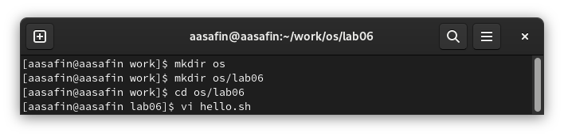
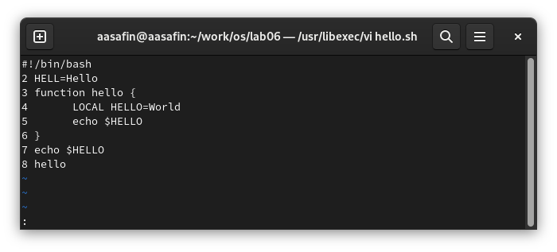
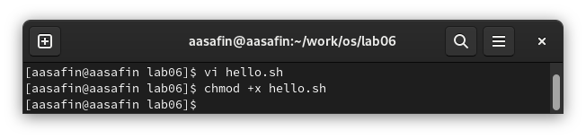
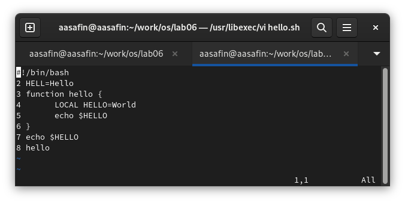
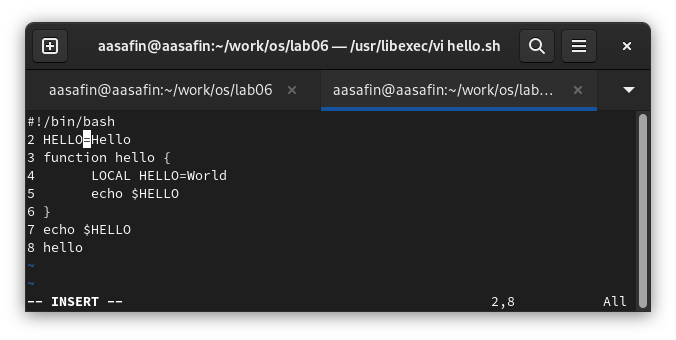
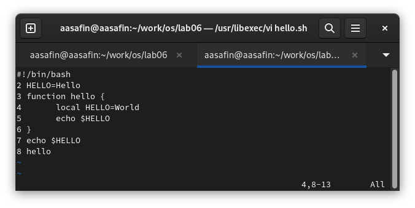
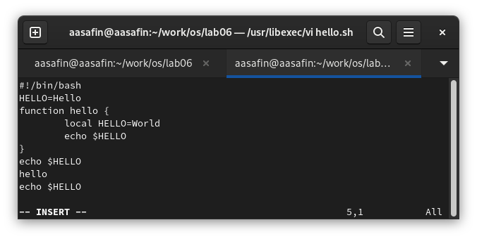
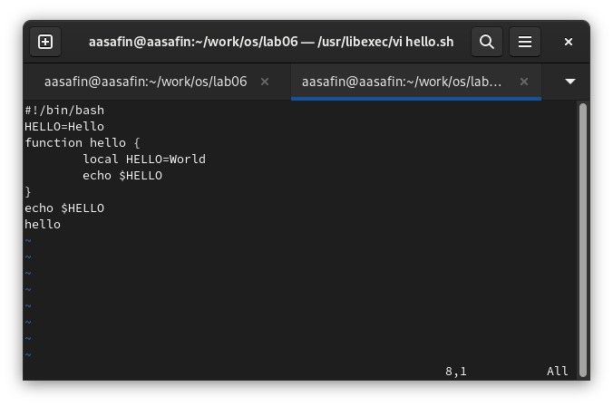
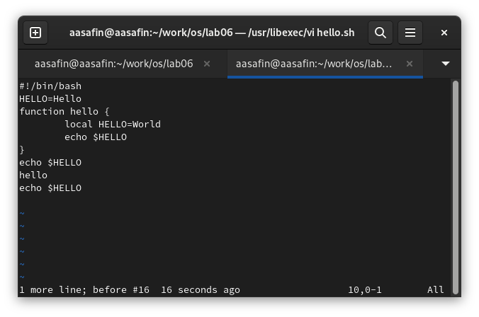
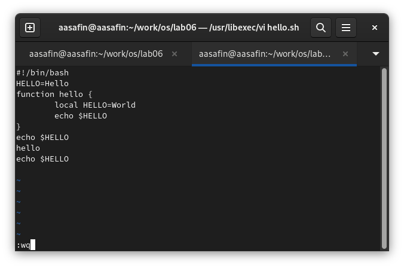

---
## Front matter
title: "Лабораторная работа 7"
author: "Сафин Андрей Алексеевич"

## Generic otions
lang: ru-RU
toc-title: "Содержание"

## Bibliography
bibliography: bib/cite.bib
csl: pandoc/csl/gost-r-7-0-5-2008-numeric.csl

## Pdf output format
toc: true # Table of contents
toc-depth: 2
lof: true # List of figures
lot: true # List of tables
fontsize: 12pt
linestretch: 1.5
papersize: a4
documentclass: scrreprt
## I18n polyglossia
polyglossia-lang:
  name: russian
  options:
	- spelling=modern
	- babelshorthands=true
polyglossia-otherlangs:
  name: english
## I18n babel
babel-lang: russian
babel-otherlangs: english
## Fonts
mainfont: PT Serif
romanfont: PT Serif
sansfont: PT Sans
monofont: PT Mono
mainfontoptions: Ligatures=TeX
romanfontoptions: Ligatures=TeX
sansfontoptions: Ligatures=TeX,Scale=MatchLowercase
monofontoptions: Scale=MatchLowercase,Scale=0.9
## Biblatex
biblatex: true
biblio-style: "gost-numeric"
biblatexoptions:
  - parentracker=true
  - backend=biber
  - hyperref=auto
  - language=auto
  - autolang=other*
  - citestyle=gost-numeric
## Pandoc-crossref LaTeX customization
figureTitle: "Рис."
tableTitle: "Таблица"
listingTitle: "Листинг"
lofTitle: "Список иллюстраций"
lotTitle: "Список таблиц"
lolTitle: "Листинги"
## Misc options
indent: true
header-includes:
  - \usepackage{indentfirst}
  - \usepackage{float} # keep figures where there are in the text
  - \floatplacement{figure}{H} # keep figures where there are in the text
---

# Цель работы

Познакомиться с операционной системой Linux. Получить практические навыки работы с редактором vi, установленным по умолчанию практически во всех дистрибутивах.

# Задание

Выполнить описанные в работе действия с редактором vi.

# Теоретическое введение

vi - это текстовый редактор ОС семейства UNIX. Он позволяет создавать и редактировать текстовые файлы. Основные режимы его работы - командный, режим вставки, режим последней строки.

# Выполнение лабораторной работы

1. Создана директория ~/work/os/lab06; создан и открыт файл hello.sh с помощью vi (рис. @fig:001). Введен данный в лабораторной работе текст (рис. @fig:002). Осущетсвлен переход в командный режим, а затем в режим последней строки (рис. @fig:003). Файл сохранен, права на исполнение даны (рис. @fig:004). 

{#fig:001 width=70%}

{#fig:002 width=70%}

{#fig:003 width=70%}

{#fig:004 width=70%}

2. Файл открыт для редактирования (рис. @fig:005). HELL заменено на HELLO (рис. @fig:006). LOCAL заменено на local (рис. @fig:007). В конец вставлена строка echo $HELLO (рис. @fig:008). Удалена последняя строка (рис. @fig:009). Действие отменено (рис. @fig:010). Файл сохранен (рис. @fig:011).

{#fig:005 width=70%}

{#fig:006 width=70%}

{#fig:007 width=70%}

{#fig:008 width=70%}

{#fig:009 width=70%}

{#fig:010 width=70%}

{#fig:011 width=70%}

# Выводы

Описанные действия с vi произведены, навык работы получен.
