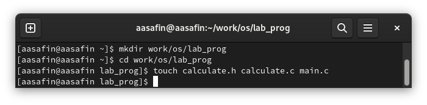
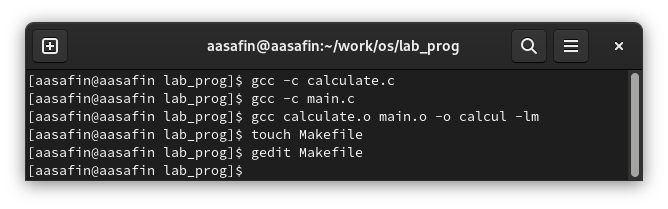
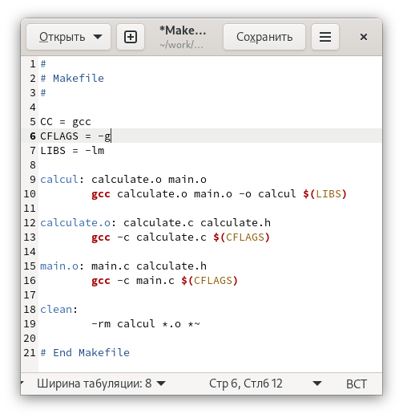
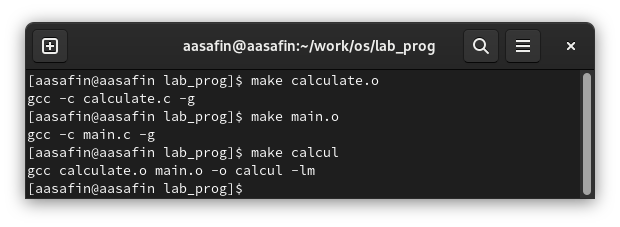
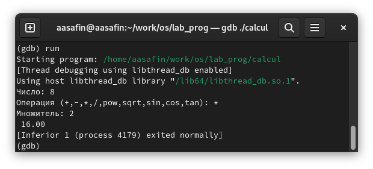
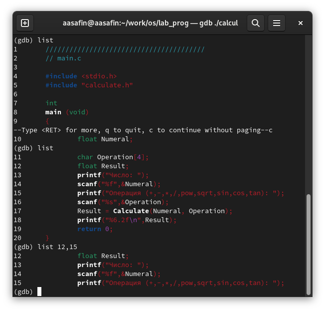
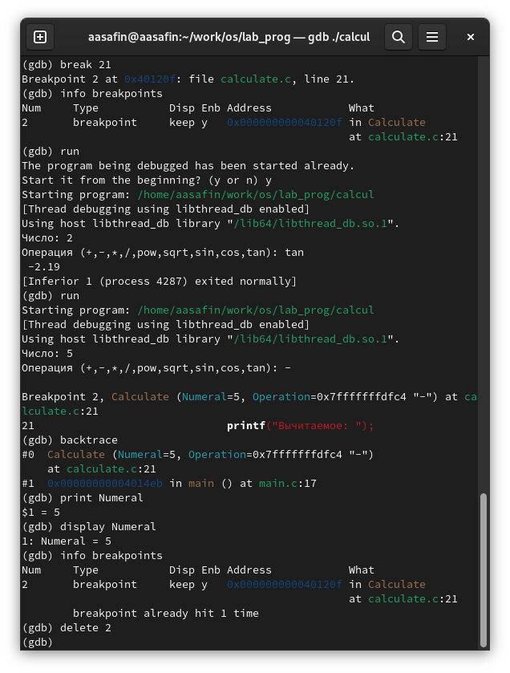
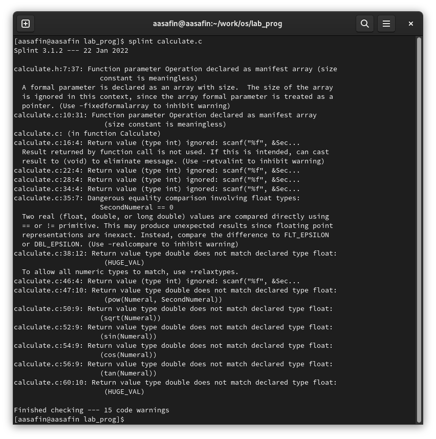
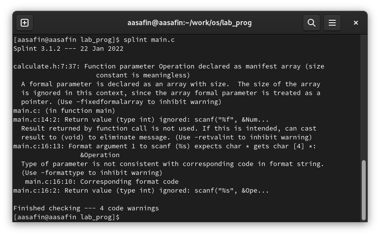

---
## Front matter
title: "Лабораторная работа 13"
author: "Сафин Андрей Алексеевич"

## Generic otions
lang: ru-RU
toc-title: "Содержание"

## Bibliography
bibliography: bib/cite.bib
csl: pandoc/csl/gost-r-7-0-5-2008-numeric.csl

## Pdf output format
toc: true # Table of contents
toc-depth: 2
lof: true # List of figures
lot: true # List of tables
fontsize: 12pt
linestretch: 1.5
papersize: a4
documentclass: scrreprt
## I18n polyglossia
polyglossia-lang:
  name: russian
  options:
	- spelling=modern
	- babelshorthands=true
polyglossia-otherlangs:
  name: english
## I18n babel
babel-lang: russian
babel-otherlangs: english
## Fonts
mainfont: PT Serif
romanfont: PT Serif
sansfont: PT Sans
monofont: PT Mono
mainfontoptions: Ligatures=TeX
romanfontoptions: Ligatures=TeX
sansfontoptions: Ligatures=TeX,Scale=MatchLowercase
monofontoptions: Scale=MatchLowercase,Scale=0.9
## Biblatex
biblatex: true
biblio-style: "gost-numeric"
biblatexoptions:
  - parentracker=true
  - backend=biber
  - hyperref=auto
  - language=auto
  - autolang=other*
  - citestyle=gost-numeric
## Pandoc-crossref LaTeX customization
figureTitle: "Рис."
tableTitle: "Таблица"
listingTitle: "Листинг"
lofTitle: "Список иллюстраций"
lotTitle: "Список таблиц"
lolTitle: "Листинги"
## Misc options
indent: true
header-includes:
  - \usepackage{indentfirst}
  - \usepackage{float} # keep figures where there are in the text
  - \floatplacement{figure}{H} # keep figures where there are in the text
---

# Цель работы

Приобрести простейшие навыки разработки, анализа, тестирования и отладки при-
ложений в ОС типа UNIX/Linux на примере создания на языке программирования
С калькулятора с простейшими функциями.

# Задание

Написать программу-калькулятор и отладить её.

# Теоретическое введение

В процессе разработки ПО в=неизбежно возникают различного рода ошибки. Для их нахождения и исправления применяются специальные утилиты - средства отладки. Примерами могут являться:
- GDB
- Splint

# Выполнение лабораторной работы

1. Создана подкаталог ~/work/os/lab_prog (рис. @fig:001). 
2. Созданы файлы calculate.h, calculate.c, main.c (рис. @fig:001).
3. Выполнена компиляция файлов (рис. @fig:002).
4. Синтаксических ошибок невыявлено.
5. Создан Makefile (рис. @fig:002).
6. Makefile исправлен (строка 6) (рис. @fig:003). Этот файл позволяет с помощью make автоматически компилировать calculate.c, calculate.h, main.h в исполняемый файл calcul.

{#fig:001 width=70%}

{#fig:002 width=70%}

{#fig:003 width=70%}

Файлы скомпилированы заново с помощью make (рис. @fig:004). Запущен отладчик GDB, использвоана команда run (рис. @fig:005). Произведены различные действия с list (рис. @fig:006). Создана точка останова, после выполнения выведена информация о ней и о значении Numeral в момент точки останова, после чего она удалена (рис. @fig:007).

{#fig:004 width=70%}

{#fig:005 width=70%}

{#fig:006 width=70%}

{#fig:007 width=70%}

7. Произведен анализ файлов calculate.c и main.c с помощью splint (рис. @fig:008-@fig:009).

{#fig:008 width=70%}

{#fig:009 width=70%}

# Выводы

Навык работы со средствами отладки в GNU Linux получен.
