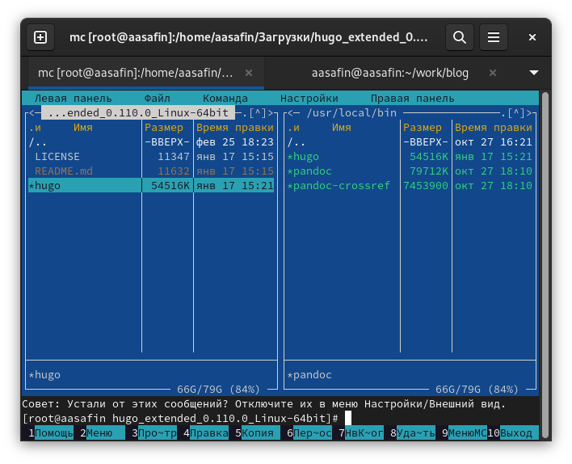
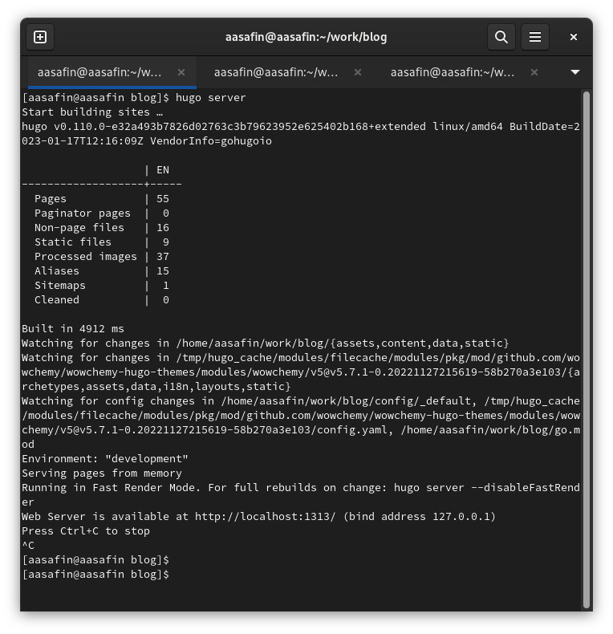
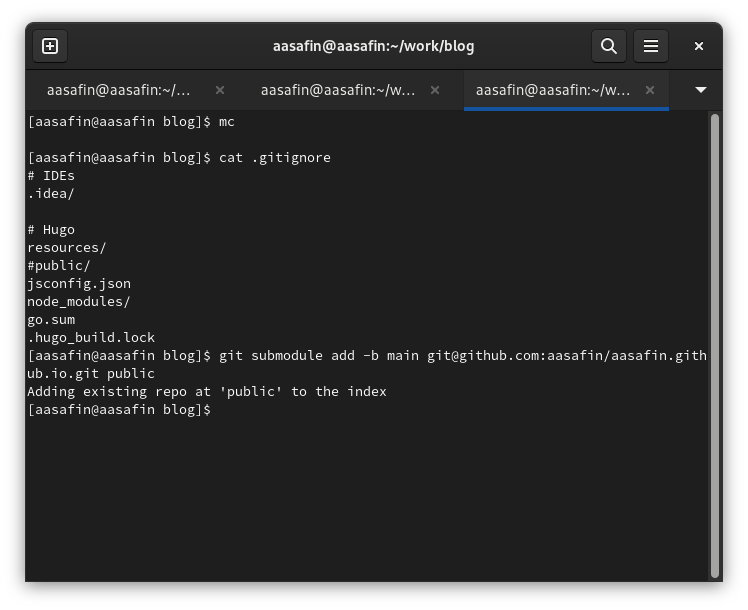
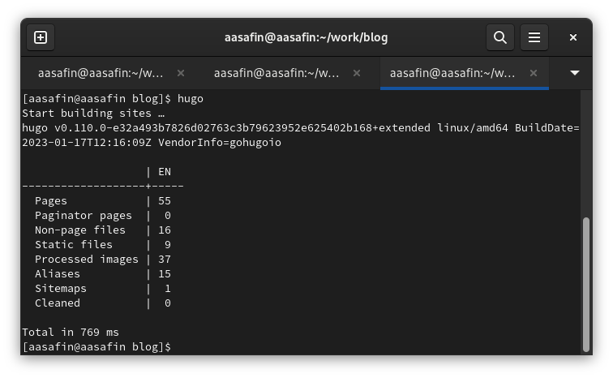
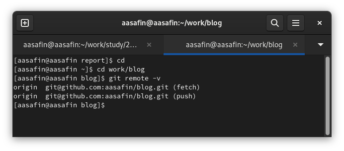
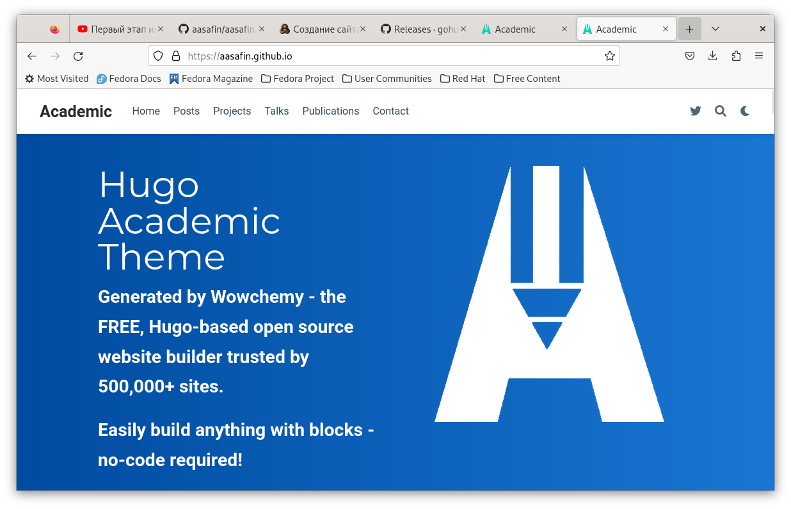

---
## Front matter
lang: ru-RU
title: Первый этап индивидуального проекта
author:
  - Сафин А. А.
institute:
  - Российский университет дружбы народов, Москва, Россия

## i18n babel
babel-lang: russian
babel-otherlangs: english

## Formatting pdf
toc: false
toc-title: Содержание
slide_level: 2
aspectratio: 169
section-titles: true
theme: metropolis
header-includes:
 - \metroset{progressbar=frametitle,sectionpage=progressbar,numbering=fraction}
 - '\makeatletter'
 - '\beamer@ignorenonframefalse'
 - '\makeatother'
---

# Информация

## Докладчик

:::::::::::::: {.columns align=center}
::: {.column width="70%"}

  * Сафин Андрей Алексеевич
  * студент первого курса направления НММ
  * Российский университет дружбы народов

:::
::: {.column width="30%"}

:::
::::::::::::::

# Вводная часть

## Цели и задачи

- Целью индивидуального проекта является приобретение навыка создания сайта научного работника и получение конечного результата.
- На данном этапе задачей является выгрузка шаблона сайта в сеть.

# Выполнение этапа

## Установка hugo

{#fig:001 width=55%}

## Создание репозитория и локальной страницы

{#fig:002 width=40%}

## Подключение субмодуля 

{#fig:003 width=55%}

## Подготовка сайта к работе в сети

{#fig:004 width=70%}

## Подготовка сайта к работе в сети

{#fig:005 width=70%}

## Итог

{#fig:006 width=70%}

# Заключительная часть

## Вывод

Навыки создания рабочего сайта по шаблону получены, страница работает по сети
