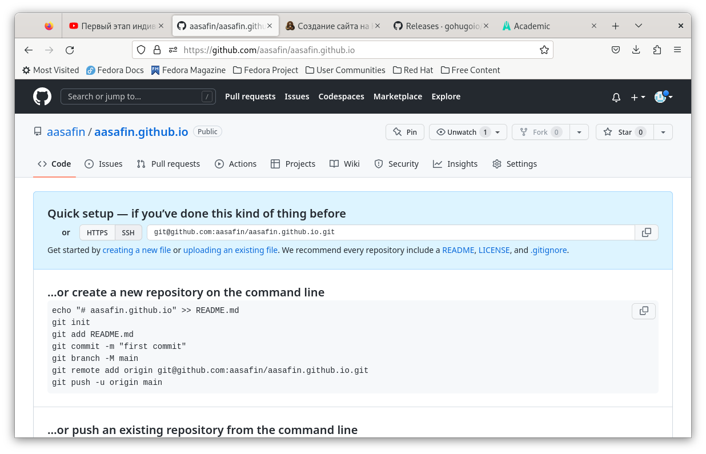

---
## Front matter
title: "Отчёт по первому этапу индивидуального проекта"
author: "Сафин Андрей Алексеевич"

## Generic otions
lang: ru-RU
toc-title: "Содержание"

## Bibliography
bibliography: bib/cite.bib
csl: pandoc/csl/gost-r-7-0-5-2008-numeric.csl

## Pdf output format
toc: true # Table of contents
toc-depth: 2
lof: true # List of figures
lot: true # List of tables
fontsize: 12pt
linestretch: 1.5
papersize: a4
documentclass: scrreprt
## I18n polyglossia
polyglossia-lang:
  name: russian
  options:
	- spelling=modern
	- babelshorthands=true
polyglossia-otherlangs:
  name: english
## I18n babel
babel-lang: russian
babel-otherlangs: english
## Fonts
mainfont: PT Serif
romanfont: PT Serif
sansfont: PT Sans
monofont: PT Mono
mainfontoptions: Ligatures=TeX
romanfontoptions: Ligatures=TeX
sansfontoptions: Ligatures=TeX,Scale=MatchLowercase
monofontoptions: Scale=MatchLowercase,Scale=0.9
## Biblatex
biblatex: true
biblio-style: "gost-numeric"
biblatexoptions:
  - parentracker=true
  - backend=biber
  - hyperref=auto
  - language=auto
  - autolang=other*
  - citestyle=gost-numeric
## Pandoc-crossref LaTeX customization
figureTitle: "Рис."
tableTitle: "Таблица"
listingTitle: "Листинг"
lofTitle: "Список иллюстраций"
lotTitle: "Список таблиц"
lolTitle: "Листинги"
## Misc options
indent: true
header-includes:
  - \usepackage{indentfirst}
  - \usepackage{float} # keep figures where there are in the text
  - \floatplacement{figure}{H} # keep figures where there are in the text
---

# Цель работы

Освоение методов создания сайтов с hugo и github. 

# Задание

Создание рабочего шаблона сайта с помощью github и hugo.

# Выполнение работы

Был установлен hugo (рис. @fig:001), создан репозиторий для блога с помощью шаблона (рис. @fig:002), затем клонирован на виртуальную машину  (рис. @fig:003).

{#fig:001 width=70%}

{#fig:002 width=70%}

{#fig:003 width=70%}

С помощью команды hugo server (рис. @fig:004) была создана веб-страница  (рис. @fig:005).

{#fig:004 width=70%}

{#fig:005 width=70%}

Далее веб-страница была выгружена в сеть. Для этого был создан пустой репозиторий с будущим адресом страницы (рис. @fig:006) и клонирован на компьютер (рис. @fig:007). Затем был изменен файл .gitignore для того, чтоб можно было добавить субмодуль в папку public первоначального репозитория (рис. @fig:008).

{#fig:006 width=70%}

{#fig:007 width=70%}

{#fig:008 width=70%}

После чего была выполнена команда hugo (рис. @fig:009), изменения были сохранены на github (рис. @fig:010).

{#fig:009 width=70%}

{#fig:010 width=70%}

Итого, сайт готов к работе (рис. @fig:011).

{#fig:011 width=70%}

# Выводы

Первоначальные действия по созданию сайта были произведены успешно.
