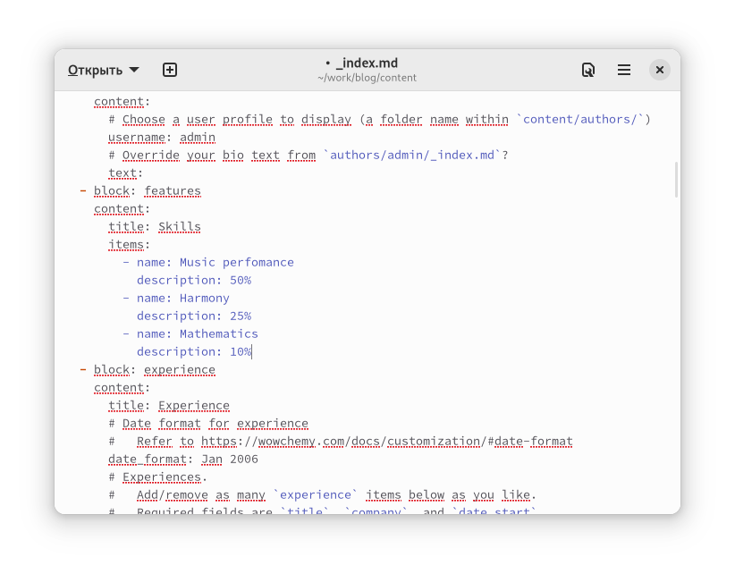
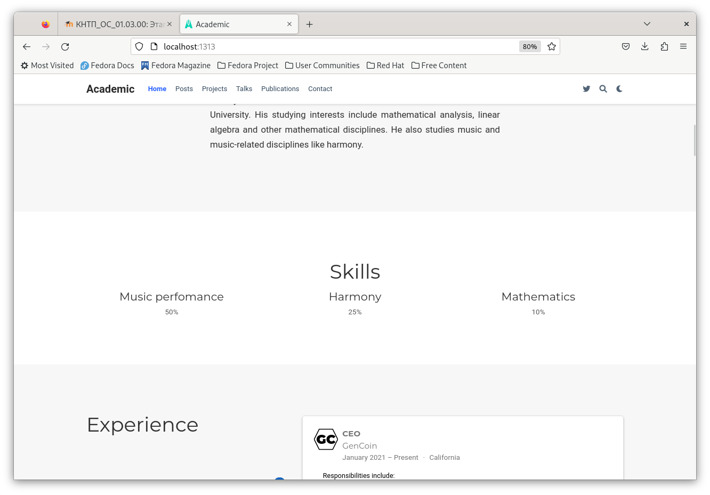
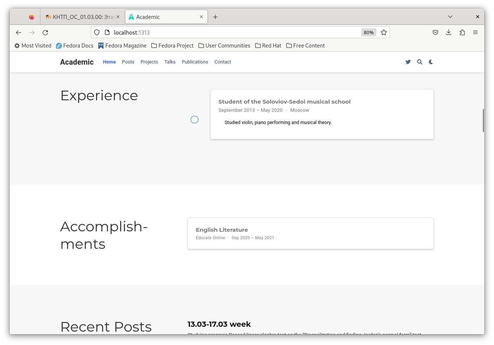
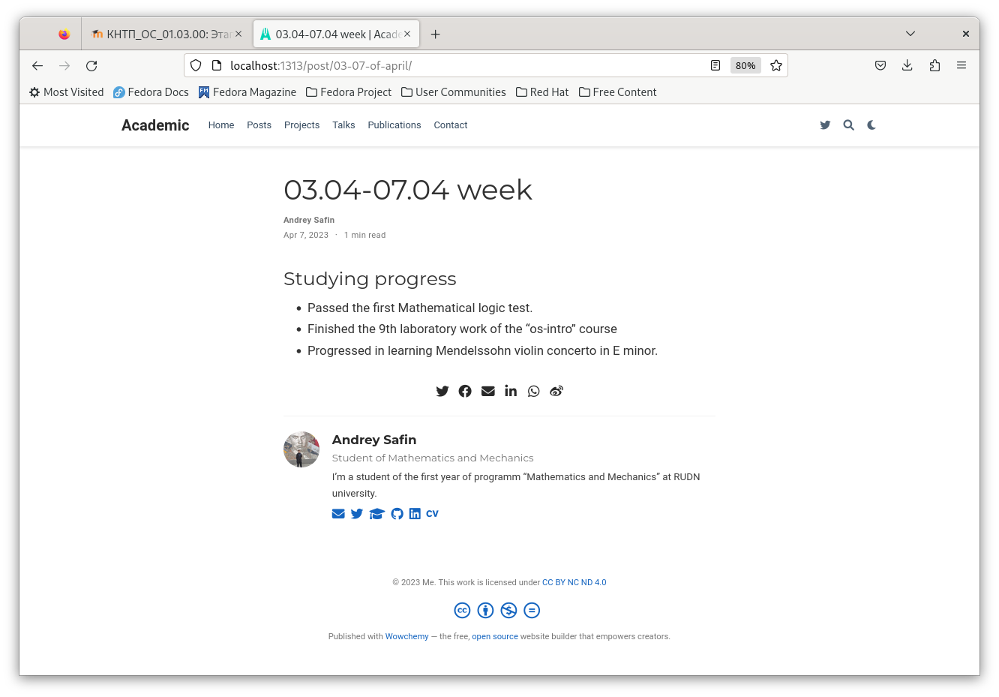
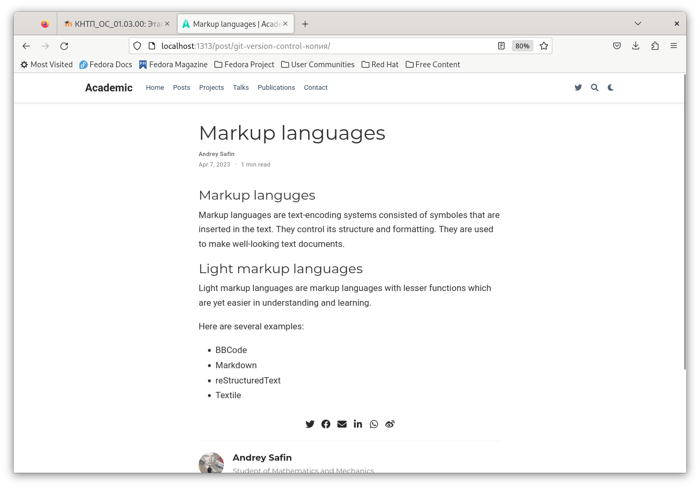
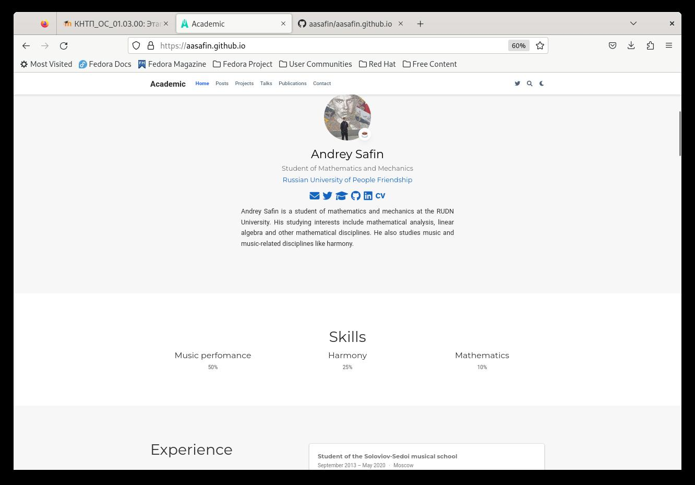

---
## Front matter
lang: ru-RU
title: Третий этап индивидуального проекта
author:
  - Сафин А. А.
institute:
  - Российский университет дружбы народов, Москва, Россия

## i18n babel
babel-lang: russian
babel-otherlangs: english

## Formatting pdf
toc: false
toc-title: Содержание
slide_level: 2
aspectratio: 169
section-titles: true
theme: metropolis
header-includes:
 - \metroset{progressbar=frametitle,sectionpage=progressbar,numbering=fraction}
 - '\makeatletter'
 - '\beamer@ignorenonframefalse'
 - '\makeatother'
---

# Информация

## Докладчик

:::::::::::::: {.columns align=center}
::: {.column width="70%"}

  * Сафин Андрей Алексеевич
  * студент первого курса направления НММ
  * Российский университет дружбы народов

:::
::: {.column width="30%"}

:::
::::::::::::::

# Вводная часть

## Цели и задачи

- Приобретение навыков создания персонального сайта
- Размещение информации о владельце на сайт
- Размещение постов

# Основная часть

## Выполнение этапа

{#fig:001 width=50%}

## Выполнение этапа

{#fig:002 width=50%}

## Выполнение этапа

{#fig:003 width=50%}

## Выполнение этапа

{#fig:004 width=50%}

## Выполнение этапа

{#fig:005 width=50%}

## Выполнение этапа

{#fig:006 width=50%}

# Заключительная часть

## Вывод

Необходимая информация размещена на сайт.

