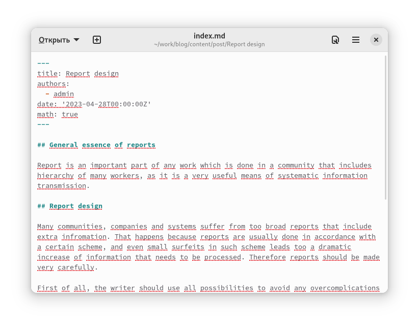

---
## Front matter
title: "Четвертый этап индивидуального проекта"
author: "Сафин Андрей Алексеевич"

## Generic otions
lang: ru-RU
toc-title: "Содержание"

## Bibliography
bibliography: bib/cite.bib
csl: pandoc/csl/gost-r-7-0-5-2008-numeric.csl

## Pdf output format
toc: true # Table of contents
toc-depth: 2
lof: true # List of figures
lot: true # List of tables
fontsize: 12pt
linestretch: 1.5
papersize: a4
documentclass: scrreprt
## I18n polyglossia
polyglossia-lang:
  name: russian
  options:
	- spelling=modern
	- babelshorthands=true
polyglossia-otherlangs:
  name: english
## I18n babel
babel-lang: russian
babel-otherlangs: english
## Fonts
mainfont: PT Serif
romanfont: PT Serif
sansfont: PT Sans
monofont: PT Mono
mainfontoptions: Ligatures=TeX
romanfontoptions: Ligatures=TeX
sansfontoptions: Ligatures=TeX,Scale=MatchLowercase
monofontoptions: Scale=MatchLowercase,Scale=0.9
## Biblatex
biblatex: true
biblio-style: "gost-numeric"
biblatexoptions:
  - parentracker=true
  - backend=biber
  - hyperref=auto
  - language=auto
  - autolang=other*
  - citestyle=gost-numeric
## Pandoc-crossref LaTeX customization
figureTitle: "Рис."
tableTitle: "Таблица"
listingTitle: "Листинг"
lofTitle: "Список иллюстраций"
lotTitle: "Список таблиц"
lolTitle: "Листинги"
## Misc options
indent: true
header-includes:
  - \usepackage{indentfirst}
  - \usepackage{float} # keep figures where there are in the text
  - \floatplacement{figure}{H} # keep figures where there are in the text
---

# Цель работы

Целью индивидуального проекта является приобретение навыков создания персонального сайта с помощью hugo и github.

# Задание

- Разместить информацию об академических ресурсах.
- Сделать пост по прошедшей неделе.
- Добавить пост на тему по выбору:
1. Оформление отчета
2. Создание презентации
3. Работа с библиографией

# Выполнение этапа

1. Размещены ссылки на научные и библиометрические ресурсы, на которых удалось создать профиль (рис. @fig:001-@fig:002).

2. Размещен пост по прошедшей неделе (рис. @fig:003-@fig:004).

3. Размещен пост по оформлению отчетов (рис. @fig:005-@fig:006).

4. Изменения выгружены на сайт (aasafin.github.io).

{#fig:001 width=70%}

{#fig:002 width=70%}

{#fig:003 width=70%}

{#fig:004 width=70%}

{#fig:005 width=70%}

{#fig:006 width=70%}

# Выводы

Необходимая информация добавлена, сайт видоизменен (можно проверить по адресу aasafin.github.io). 
